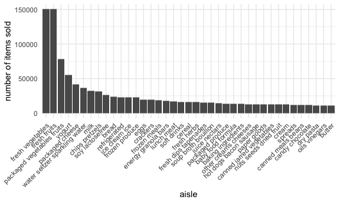
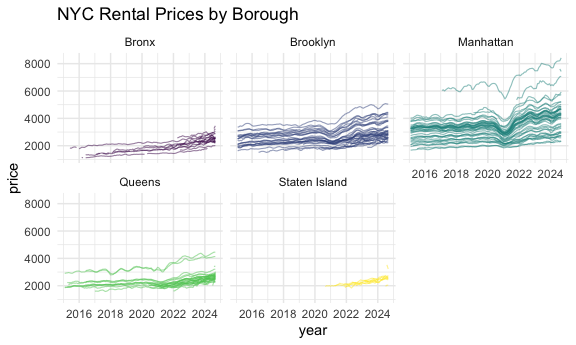
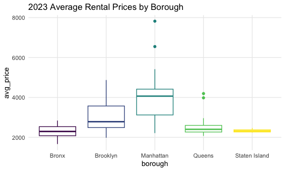

hw3
================
2025-10-12

## Problem 1

Import dataset

``` r
data("instacart")
```

There are 1384617 rows and 15 in the `instacart` dataset. The dataset
include these variables: order_id, product_id, add_to_cart_order,
reordered, user_id, eval_set, order_number, order_dow,
order_hour_of_day, days_since_prior_order, product_name, aisle_id,
department_id, aisle, department.

Here are some of the key important variables with illustrative
observations showing the order of each product, product information,
whether it’s reordered and the days since the prior order:

``` r
set.seed(1234)
instacart |> 
  select(order_id, reordered, days_since_prior_order, product_name, aisle, department) |> 
  relocate(order_id, product_name) |> 
  slice_sample(n = 10) |> 
  knitr::kable()
```

| order_id | product_name | reordered | days_since_prior_order | aisle | department |
|---:|:---|---:|---:|:---|:---|
| 740700 | Bag of Organic Bananas | 1 | 25 | fresh fruits | produce |
| 2302051 | Baby Swiss Cheese | 1 | 30 | packaged cheese | dairy eggs |
| 721041 | Gluten Free Original Granola | 1 | 12 | granola | breakfast |
| 2519057 | Total 0% Nonfat Plain Greek Yogurt | 1 | 15 | yogurt | dairy eggs |
| 308551 | Red Bell Pepper | 1 | 14 | fresh vegetables | produce |
| 840856 | Creamy Peanut Butter | 1 | 16 | spreads | pantry |
| 2138437 | Wholesome Breakfast Apple Raisin Baby Food | 1 | 25 | baby food formula | babies |
| 2150528 | Raspberries | 1 | 28 | packaged produce | produce |
| 609394 | Light, Very Vanilla | 0 | 30 | yogurt | dairy eggs |
| 3388629 | Part Skim Mozzarella Cheese | 1 | 7 | packaged cheese | dairy eggs |

Each row in the dataset represents a single product (`product_id`)
purchase history from a user (`user_id`). The same `order_id` means that
these products are purchased together as a single order. Other key
information include where the product is from: `aisle_id`, `aisle`,
`department` and `department_id`, and when the order happened:
`order_hour_of_day`, `order_dow` (day of the week).

Number of aisles + which have most items ordered:

``` r
num_aisle = 
  instacart |> 
  distinct(aisle_id) |> # find distinct aisle id to get how many aisles in the dataset
  nrow()

most_items_aisle = 
  instacart |> 
  count(aisle, sort = TRUE) |> # The most items ordered aisle means that it occurs the most
  slice(1:5) |> 
  pull(aisle)
```

There are 134 aisles, and fresh vegetables, fresh fruits, packaged
vegetables fruits, yogurt, packaged cheese have the most items ordered.

Creating the aisle plot:

``` r
  instacart |> 
  group_by(aisle) |> 
  summarize(
    n_items = n()
  ) |> 
  filter(n_items > 10000) |> # only select aisles with more than 10000 items
  mutate(
    aisle = fct_reorder(aisle, n_items, .desc = TRUE)
  ) |> 
  ggplot(aes(x = aisle, y = n_items)) + 
  geom_col() +
  theme(axis.text.x = element_text(angle = 45, hjust = 1)) +
  labs(
    x = "aisle",
    y = "number of items sold"
  ) 
```



Make a table showing popular items in these three aisles: “baking
ingredients”, “dog food care”, “packaged vegetables fruits”:

``` r
  instacart |> 
  filter(aisle %in% c("baking ingredients", "dog food care", "packaged vegetables fruits")) |>
  group_by(aisle, product_name) |> 
  summarize(
    times_ordered  = n(),
    .groups = "drop_last" # keep grouping as aisle but not product_name
  ) |> 
  slice_max(times_ordered, n = 3) |> 
  knitr::kable()
```

| aisle | product_name | times_ordered |
|:---|:---|---:|
| baking ingredients | Light Brown Sugar | 499 |
| baking ingredients | Pure Baking Soda | 387 |
| baking ingredients | Cane Sugar | 336 |
| dog food care | Snack Sticks Chicken & Rice Recipe Dog Treats | 30 |
| dog food care | Organix Chicken & Brown Rice Recipe | 28 |
| dog food care | Small Dog Biscuits | 26 |
| packaged vegetables fruits | Organic Baby Spinach | 9784 |
| packaged vegetables fruits | Organic Raspberries | 5546 |
| packaged vegetables fruits | Organic Blueberries | 4966 |

Make a mean hour table:

``` r
  instacart |> 
  filter(product_name %in% c("Pink Lady Apples","Coffee Ice Cream")) |> 
  mutate(dow = factor(
    order_dow, levels = 0:6,
    labels = c("Sun","Mon","Tue","Wed","Thu","Fri","Sat") # rename the dow
  )) |>
  group_by(product_name, dow) |> 
  summarize(
    mean_hour = round(mean(order_hour_of_day, na.rm = TRUE), 2)
  ) |>
  pivot_wider(
    names_from = dow, 
    values_from = mean_hour) |>
 knitr::kable()
```

| product_name     |   Sun |   Mon |   Tue |   Wed |   Thu |   Fri |   Sat |
|:-----------------|------:|------:|------:|------:|------:|------:|------:|
| Coffee Ice Cream | 13.77 | 14.32 | 15.38 | 15.32 | 15.22 | 12.26 | 13.83 |
| Pink Lady Apples | 13.44 | 11.36 | 11.70 | 14.25 | 11.55 | 12.78 | 11.94 |

## Problem 2

Import the zillow and zipcode datset and merge:

``` r
nyc_zillow_df = 
  read_csv("data/Zip_zori_uc_sfrcondomfr_sm_month_NYC.csv") |> 
  pivot_longer(
    -(RegionID:CountyName),
    names_to = "month",
    values_to = "price") |> 
  janitor::clean_names() |> 
  rename(zip_code = region_name) |> 
  mutate(
    month = as_date(month),
    year = floor_date(month, unit = "year"),
    zip_code = as.numeric(zip_code)) |> 
  select(-county_name)

zip_codes_df = 
  read_csv("data/Zip Codes.csv") |> 
  janitor::clean_names() |> 
  filter(
    !(zip_code == 10463 & county == "New York"),
    !(zip_code == 11201 & county == "New York"))  |> 
  mutate(
    borough = case_match(
      county,
      "Bronx" ~ "Bronx",
      "Kings" ~ "Brooklyn",
      "New York" ~ "Manhattan",
      "Queens" ~ "Queens",
      "Richmond" ~ "Staten Island"
    )
  ) |> 
  select(zip_code, borough, neighborhood)

nyc_price_df = 
  left_join(nyc_zillow_df, zip_codes_df, by = "zip_code")
```

ZIP codes observed 116 times and fewer than 10 times:

``` r
zipcode_obs =
  nyc_price_df |>
  filter(
    month >= ymd("2015-01-01"),
    month <= ymd("2024-08-31"),
    !is.na(price)
  ) |>
  group_by(zip_code) |>
  summarize(
    n_months = n()
  )
 
n_116_times = 
  zipcode_obs |> 
  filter(n_months == 116) |> 
  nrow()

n_fewer10 = 
  zipcode_obs |> 
  filter(n_months < 10) |> 
  nrow()
```

There are 48 zipcodes observed 116 times and 26 zipcodes observed fewer
than 10 times. This is because some of the zip code areas are standard
residential areas but some are not.

Create a table showing the average rental price in each borough and
year:

``` r
  nyc_price_df |> 
  mutate(year = format(year, "%Y")) |>
  group_by(borough, year) |> 
  summarize(
    avg_price_year = round(mean(price, na.rm = TRUE), 2)
  ) |> 
  pivot_wider(
    names_from = year,
    values_from = avg_price_year
  ) |> 
  knitr::kable()
```

| borough | 2015 | 2016 | 2017 | 2018 | 2019 | 2020 | 2021 | 2022 | 2023 | 2024 |
|:---|---:|---:|---:|---:|---:|---:|---:|---:|---:|---:|
| Bronx | 1759.60 | 1520.19 | 1543.60 | 1639.43 | 1705.59 | 1811.44 | 1857.78 | 2054.27 | 2285.46 | 2496.90 |
| Brooklyn | 2492.93 | 2520.36 | 2545.83 | 2547.29 | 2630.50 | 2555.05 | 2549.89 | 2868.20 | 3015.18 | 3125.66 |
| Manhattan | 3022.04 | 3038.82 | 3133.85 | 3183.70 | 3310.41 | 3106.52 | 3136.63 | 3778.37 | 3932.61 | 4078.44 |
| Queens | 2214.71 | 2271.96 | 2263.30 | 2291.92 | 2387.82 | 2315.63 | 2210.79 | 2406.04 | 2561.62 | 2693.58 |
| Staten Island | NaN | NaN | NaN | NaN | NaN | 1977.61 | 2045.43 | 2147.44 | 2332.93 | 2536.44 |

Based on the table, average rental prices increase slowly each year
(excluding the impact of COVID-19), but after the pandemic, average
rental prices increase much higher than before in each year.

Make a plot showing NYC Rental Prices within ZIP codes for all available
years:

``` r
rental_price_plot = 
  nyc_price_df |> 
  ggplot(aes(x = month, y = price, group = zip_code, color = borough)) +
  geom_line(alpha = 0.5, linewidth = 0.4) +
  facet_wrap(~borough) +
  labs(
    x = "year",
    y = "price",
    title = "NYC Rental Prices by Borough"
  ) +
  theme_minimal() + 
  theme(
    legend.position = "none"
  )

rental_price_plot
```

    ## Warning: Removed 6804 rows containing missing values or values outside the scale range
    ## (`geom_line()`).



Based on the plot, it is clear that rental prices in all the five
boroughs increase over time. From the plot, it is also clear that there
is a drop in price during the pandemic, and in part of 2024, which is
more significant in Queens, Brooklyn, and Manhattan.

Make a plot showing ZIP-code-level rental prices across borough in 2023:

``` r
price_2023_avg_plot = 
  nyc_price_df |> 
  filter(year(month) == 2023, !is.na(price)) |>
  group_by(borough, zip_code) |>
  summarize(
    avg_price = mean(price, na.rm = TRUE)) |> 
  ggplot(aes(x = borough, y = avg_price, color = borough)) +
  geom_boxplot() +
  labs(
    title = "2023 Average Rental Prices by Borough"
  ) + 
  theme_minimal() +
  theme(
    legend.position = "none",
    panel.grid.minor = element_blank()
  )

price_2023_avg_plot
```



Based on the plot, Manhattan has the highest overall rental prices in
2023 and Staten Island has the lowest. The price range in Staten Island
is also the smallest.

Export the two plots:

``` r
library(patchwork)
result_plots = rental_price_plot + price_2023_avg_plot
ggsave("results/combined_plot.png", result_plots, width = 12, height = 10, bg = "white")
```

    ## Warning: Removed 6804 rows containing missing values or values outside the scale range
    ## (`geom_line()`).

## Problem 3

Import the two datasets, tidy and merge them

``` r
accel_df = 
  read_csv("data/nhanes_accel.csv") |> 
  janitor::clean_names()

demo_df = 
  read_csv("data/nhanes_covar.csv", skip = 4) |> 
  filter(age >= 21) |> 
  drop_na() |> 
  janitor::clean_names() |> 
  mutate(
    sex = factor(
      sex, 
      levels = c(1,2), 
      labels = c("male", "female")),
    education = factor(
      education,
      levels = c(1, 2, 3),
      labels = c("Less than high school", "High school equivalent", "More than high school")
    )
  )
```
